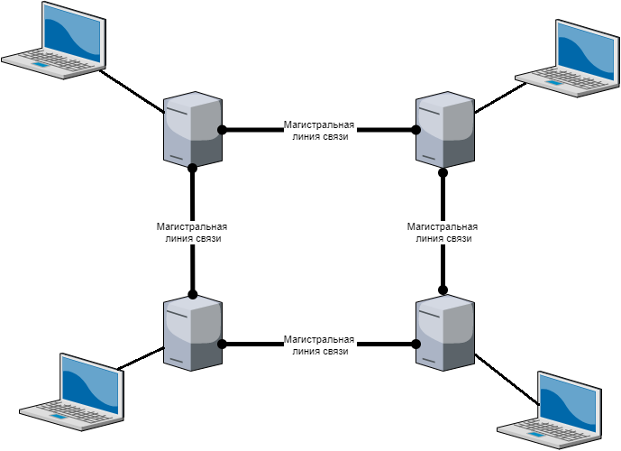

# Сети с коммутацией пакетов и мультиплексирование
## Как работают компьютерные сети. 
Еще некоторое время назад, можно сказать, персональные компьютеры использовались как самостоятельные единицы. Информация передавалась между ними только на сменных носителях, таких как перфокарты, дискеты, компакт-диски, ленточные накопители и так далее. Перемещение данных подразумевало копирование их на сменный носитель, далее, физическую доставку адресату и уже после этого копирование со сменного носителя на целевой компьютер.  
Уже тогда пользователи начали задумываться о связи нескольких компьютеров для общения между собой без посредника. Однако периферийных устройств и интерфейсов для общения с ними было сравнительно немного, и все они были по современным меркам примитивны.  
Фактически все компьютеры в то время оснащались стандартными последовательным **COM** и параллельным **LPT-портами**. Через них подключались такие устройства, как мышь, сканер или принтер. При этом информация передавалась символ за символом и принималась точно таким же образом.  
Если взять кабель, в котором линия передачи на одном конце соединена с линией приема на другом конце и наоборот — такой кабель называется **нуль-модемным**, то между компьютерами можно передавать информацию.  
Если договориться о протоколе передачи файлов, то их можно передавать в автоматическом режиме без посредников в виде сменных носителей. Важно отметить: 
- первое — аппаратная часть просто пересылает данные сплошным потоком посимвольно. 
- второе важное замечание — протокол передачи данных, если он необходим, устанавливает программы, которые используют этот порт.  

Но такой метод передачи данных (через порты COM или LTP) имеет и ряд недостатков:
 1. длина кабеля весьма ограничена; 
 2. низкая корость передачи данных;
 3. можно соединить только двух участников взаимодействия. 
 4. нет возможности использовать уже имеющиеся сети.  

 На тот момент развития техники широкое распространение получили телефонные сети, в которых передавался голос в аналоговом виде. Возникла идея — задействовать их для передачи информации между ЭВМ. Но как это сделать? Ведь телефонные сети передают голос в аналоговом виде, то есть это звуковой в диапазоне от 300 герц до 3 килогерц, а электронные вычислительные машины привыкли передавать сигнал в цифровом виде. Для решения этой задачи стали применять **модуляторы** и **демодуляторы**.  
 Прибор, который объединяет в себе две этих функции, называется **модем**. Он получает цифровую информацию, например, с **COM-порта** компьютера и преобразует звуковой сигнал согласно полученной информации. Этот процесс называется модуляция. Такой сигнал передается по телефонным линиям.  
 На приемной стороне демодулятор принимает этот сигнал и по его изменению восстанавливает изначальную цифровую последовательность, которую передают в соответствующий COM-порт приемника.  
 При этом для программ, обменивающихся информацией, фактически ничего не меняется. Они могут даже не знать о наличии модема, телефонных линий. Мы просто вставили это в разрыв нуль-модемного кабеля. Здесь важно отметить одно обстоятельство. Фактически весь процесс передачи данных разбивается на самостоятельные этапы. Они могут даже не знать, что творится на последующем или предыдущем, то есть не знать о специфике действий внутри других этапов. Таким образом, программы лишь знают, что они передают данные в COM-порт и забирают ответы из него.  
 На следующем этапе информация, если можно так сказать, уходит в провод в виде электрических импульсов стандартной длительности, амплитуды и так далее.  
 На приемной стороне эти импульсы точно так же воспринимаются и интерпретируются как некоторая цифровая последовательность, которую мы передали. Здесь мы не знаем, есть ли у нас посредник и как эти электрические импульсы преобразуются в дальнейшем. Просто есть точка передачи и точка приема информации. Модем преобразует цифровой сигнал в акустический и обратно. И он тоже не знает, что именно он преобразует и передает. Он не знает о смысле информации и о способах ее дальнейшего использования.  
 Наконец, телефонная сеть просто передает звуковой сигнал. При этом она совершенно не подозревает, что именно он из себя представляет этот звуковой сигнал — голос человека, музыка или закодированный цифровой сигнал.  
При соединении двух устройств одной линией связи обмен информацией осуществляется по очереди. Необходимым условием для успешной передачи данных должно быть наличие свободного канала связи.  
Так как для передачи голосовой информации применялись аналоговые телефонные сети. Концепция была такова, что при наборе номера один абонент соединялся с другим абонентом, владельцем этого номера, постоянным каналом передачи данных. При этом от абонентов до автоматических телефонных станций задействовались выделенные проводные каналы связи, а между АТС — магистральные каналы, в которых могли передаваться несколько сигналов от различных абонентов одновременно.  
Такая технология объединения нескольких абонентских линий в одну называется **мультиплексированием**.  
В данном же случае используется **частотное мультиплексирование**.  

Представьте такую ситуацию: у вас имеется красная лазерная указка. И вы решили передавать информацию при помощи азбуки Морзе. Если мы возьмем еще одного абонента, который передает информацию так же, и объединим эти два сигнала, они наложатся друг на друга, и увы, мы теперь не сможем их разделить два сигнала.  
Но что если перед объединением мы преобразуем сигналы от разных абонентов? Допустим, от одного из них преобразуем не в красный, а в желтый цвет? От другого — оранжевый, от третьего — зеленый и так далее. Теперь мы можем разделить эти сигналы при помощи обыкновенной призмы. Все, что нам остается сделать, это преобразовать обратно все цвета в красный и направить сигналы принимающей стороне. Такие манипуляции называются **частотным мультиплексированием**.  
Но данный вариант передачи информации не очень удобен, ведь аналоговые преобразования не так надежны, как цифровые. И если вы заняли канал передачи данных, он остается зарезервирован для вас на протяжении всего сеанса связи, даже если вы не передаёте данные. Именно поэтому широкое распространение получили технологии, в которых информация передается в цифровом виде непосредственно. Для этого она разбивается на небольшие порции, **пакеты**.  
Каждый пакет при этом путешествует по сети самостоятельно, и он даже может выбирать свой собственный маршрут, если есть его вариации. В таком случае коммуникационное оборудование используется рациональнее, ведь после передачи каждого конкретного информационного пакета оно готово выполнять следующий запрос. К тому же упрощается процесс мультиплексирования.  
Предположим, на станцию от **X** абонентов поступают информационные пакеты со скоростью **Y**. Чтобы станция могла передать все эти информационные пакеты от всех абонентов по некоторому магистральному каналу, нам всего лишь надо увеличить скорость передачи данных в **X** раз.  
В сетях с коммутацией пакетов могут возникнуть ситуации, когда разные пакеты идут разными маршрутами. Таким образом, они могут достигнуть адресата в неправильном порядке, к тому же со временем может изменяться скорость передачи данных или задержки в зависимости от загруженности коммуникационного оборудования. Некоторые пакеты могут при этом и вовсе потеряться.  
Из характеристик каналов следует отметить **задержку** и **скорость** передачи.  
**Задержка** — это временной промежуток между началом передачи и началом приема данных.  
**Скорость передачи** — это количество информации, отправляемое или принимаемое в единицу времени.  
В реальности эти параметры оптимизируются в зависимости от конкретных потребностей.  

## Предположим, вы организовали связь с Марсом. 
Пусть пропускная способность канала равна 1 гигабит в секунду. Космонавт, находясь на Марсе, решил посмотреть потоковое видео. Видеоролик даже в самом хорошем качестве займет малую часть пропускной способности нашего канала. Но чтобы передать запрос на просмотр видео, радиосигнал с Марса до Земли потратит время от трех до 20 минут.  
Столько же времени пройдет от начала передачи потокового видео до начала его приема. Таким образом, космонавт сможет посмотреть видеоролик, но не сразу.  
В случае обратной ситуации, когда задержка мала, но скорость передачи данных невелика, вы не сможете посмотреть потоковое видео, но узнаете об этом фактически сразу же.  
